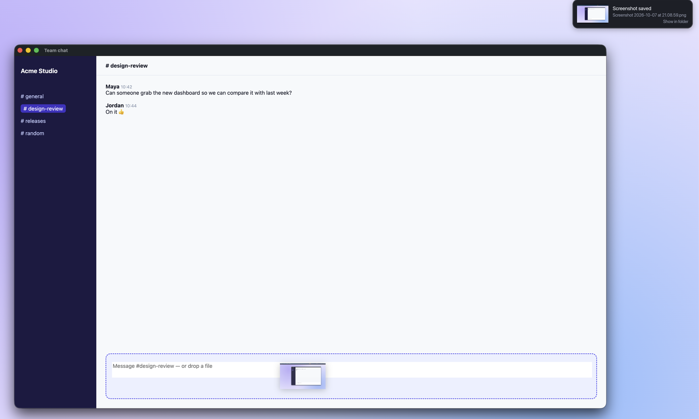
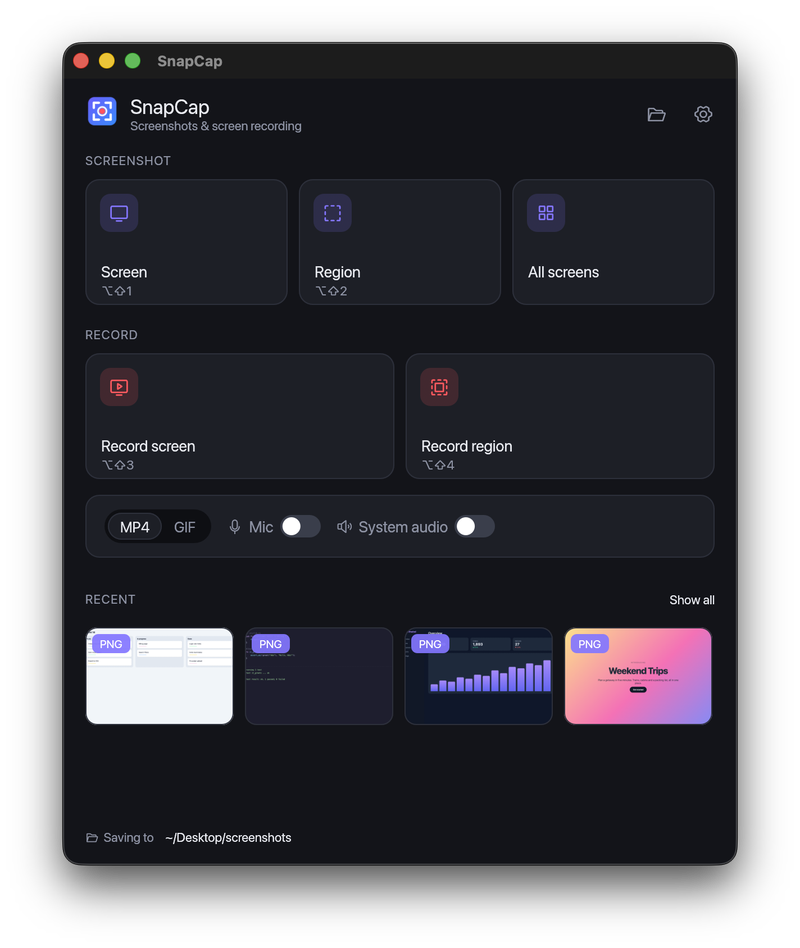
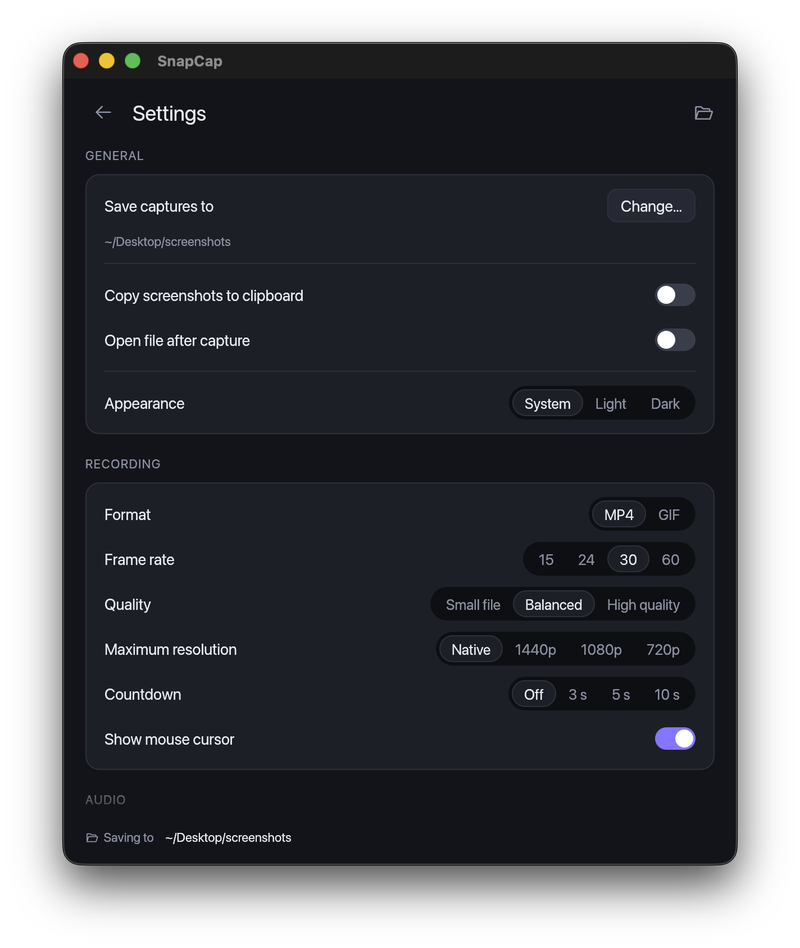
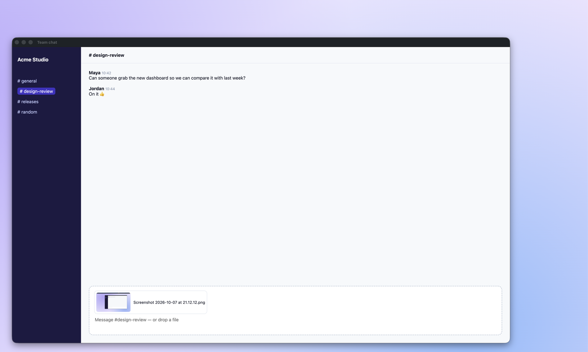

# SnapCap

A small, fast screenshot and screen-recording app for **macOS, Windows and Ubuntu**.
It's a single native binary (about 8 MB). The H.264 and AAC encoders, GIF encoder,
tray icon and UI are all compiled in, so there's nothing else to install: no ffmpeg,
no runtimes and no redistributables.

Captures are saved to **`~/Desktop/screenshots`** by default. The folder is created
automatically, and you can change it in Settings.



*Take a screenshot, then drag the notice straight into a chat, a browser tab, a text box, a
folder or an app, the same way you drag the macOS screenshot thumbnail.*

## Download

Grab the latest build from the [Releases page](../../releases/latest):

| OS | File |
|---|---|
| macOS 13+ (Apple silicon and Intel) | `SnapCap-<version>-macos-universal.dmg` |
| Windows 10/11 | `SnapCap-<version>-windows-x64.zip` |
| Ubuntu 24.04+ | `snapcap_<version>_amd64.deb` or `snapcap-<version>-linux-amd64.tar.gz` |

The builds aren't signed with a paid Apple or Microsoft certificate yet, so the first launch
needs one extra step:

- **macOS:** drag SnapCap to Applications and open it. If macOS says it can't verify the
  developer, open *System Settings → Privacy & Security* and click **Open Anyway**. Or run
  `xattr -dr com.apple.quarantine /Applications/SnapCap.app` once.
- **Windows:** if SmartScreen shows "Windows protected your PC", click **More info → Run anyway**.

## What it does

- **Screenshots:** the screen under the mouse, all screens stitched together, or a region.
  - For a region, SnapCap freezes the screen, then you drag a box over it. A magnifier
    shows exact pixels, and the selection size is shown as you drag.
  - Screenshots are saved as PNG and also copied to the clipboard (you can turn this off).
- **Recordings:** a whole screen or a region, saved as **MP4** (H.264 + AAC) or **GIF**.
  - **Audio:** microphone and/or system audio (MP4 only).
  - **Controls:** pause/resume, a 3-second countdown, and a floating control bar. The
    recorded area is outlined.
  - On macOS and Windows, SnapCap's own windows (the bar, the outline and notices) never show
    up in your recordings. On Linux the outline sits just outside the recorded area, but the
    control bar will appear in full-screen recordings.
- **Lives in the menu bar / system tray.** Closing the window keeps SnapCap running.
  - After each capture, a notice with a thumbnail appears. Click it to open the file.
- **Drag and drop captures anywhere.** Drag the notice that appears after a capture and drop
  it wherever a file can go:
  - a chat (Discord, Slack, Teams), an email, or any upload area or text box in a browser
  - a Finder or Explorer folder, or the desktop
  - an app window or a Dock icon (for example Preview, Photoshop or Figma)

  The file is copied, so the original stays in your captures folder. When the drop lands, the
  notice goes away, like the macOS screenshot thumbnail. Thumbnails under *Recent* in the main
  window can be dragged out the same way. Works on macOS and Windows.
- **Global keyboard shortcuts**, configurable under *Settings → Keyboard shortcuts*:
  click a shortcut and press the new keys.
  - Esc cancels, Backspace removes the shortcut.
  - Conflicts with other actions, with other apps, or with the OS's own screenshot keys
    are flagged as you set them.
- **Command line:** `snapcap --shot region`, `--record screen`, `--record stop` and so on.
  If SnapCap is already running, the command is passed to that instance. This lets you
  bind keys in any desktop environment.

### Screenshots

| Main window | Settings |
|---|---|
|  |  |

After dropping the notice into a chat's message box, the screenshot is attached and the notice is gone:



### Default shortcuts

| Action | macOS | Windows / Linux |
|---|---|---|
| Screenshot current screen | ⌥⇧1 | Alt+Shift+1 |
| Screenshot region | ⌥⇧2 | Alt+Shift+2 |
| Record current screen | ⌥⇧3 | Alt+Shift+3 |
| Record region | ⌥⇧4 | Alt+Shift+4 |
| Pause / resume recording | ⌥⇧9 | Alt+Shift+9 |
| Stop recording | ⌥⇧0 | Alt+Shift+0 |

These avoid the system screenshot keys (⌘⇧3/4/5 on macOS, Win+Shift+S on Windows).

### In the region selector

| Input | Effect |
|---|---|
| Drag | Select an area |
| Click | Capture the whole screen |
| Enter | Confirm |
| Esc | Cancel |

When recording a region, you can move or resize the selection before pressing
**Start recording**.

## Building

You need Rust 1.95+ (`rustup`). Each script below writes its output to `dist/`.

| OS | Command | Output | Build requirements |
|---|---|---|---|
| macOS 13+ | `scripts/bundle-macos.sh` (add `--universal` for Intel + Apple silicon) | `SnapCap.app` and a DMG | Xcode Command Line Tools (the ScreenCaptureKit bridge is compiled with Swift) |
| Windows 10/11 | `powershell scripts\build-windows.ps1` | `SnapCap.exe` and a zip | Visual Studio Build Tools (C++), [NASM](https://nasm.us) for SIMD-accelerated encoding |
| Ubuntu 24.04+ | `scripts/build-linux.sh --install-deps` | `.deb` and `.tar.gz` | The script installs everything it needs with apt |

For development, `cargo run` starts the app and `cargo test` runs the test suite.

On every push, `.github/workflows/build.yml` lints, tests and packages the app on all three
operating systems. Pushing a tag such as `v0.1.0` also publishes a GitHub release with the
macOS DMG, the Windows zip and the Linux `.deb`/`.tar.gz` attached:

```sh
git tag v0.1.0 && git push origin v0.1.0
```

## Platform notes

- **macOS:**
  - The first capture asks for *Screen & System Audio Recording* permission. Enable
    SnapCap in System Settings, then reopen it. The app shows a banner with a button
    until permission is granted.
  - Recording uses ScreenCaptureKit, which does the cropping and scaling on the GPU.
  - Video is encoded by the hardware H.264 encoder (VideoToolbox). OpenH264 is the fallback.
  - System audio needs macOS 14.2 or later.
  - Dragging a capture out starts a standard AppKit file drag (a file URL with the image as the
    drag preview). Any app that accepts files from Finder accepts it.
- **Windows:**
  - Recording uses DXGI desktop duplication. SnapCap draws the mouse cursor into each frame itself.
  - System audio uses WASAPI loopback.
  - SnapCap's windows are kept out of captures with `WDA_EXCLUDEFROMCAPTURE`.
  - Dragging a capture out uses the shell's own drag (`SHDoDragDrop`), so it behaves exactly
    like dragging the file from Explorer.
- **Ubuntu / Linux:**
  - Works on X11 and Wayland. On Wayland, screen capture goes through the desktop portal,
    and GNOME asks for permission.
  - Wayland doesn't let apps register global shortcuts. Bind the `snapcap --shot …`
    commands under *Settings → Keyboard → Custom Shortcuts* instead. The exact commands
    are shown in SnapCap's settings.
  - The tray uses the StatusNotifierItem protocol, which Ubuntu supports out of the box.
  - System audio is recorded from the PulseAudio/PipeWire "Monitor" source.
  - On X11, SnapCap draws the mouse cursor into recordings itself (via XFixes). On Wayland,
    whether the cursor appears is up to the desktop portal.
  - Dragging captures out of SnapCap isn't supported on Linux yet. Use *Show in folder* and
    drag the file from your file manager instead.

## Performance

- The app uses no CPU while idle: it only redraws on input or events, and nothing is polled.
- Captured frames go through a short bounded queue to an encoder thread.
  - If the encoder falls behind, frames are dropped rather than buffered.
  - Timestamps are variable-frame-rate, so audio stays in sync even when frames are dropped.
- Colour conversion is spread across all cores (about 3 ms for a 4K frame).
- **Encoding:**
  - On macOS, H.264 runs on the hardware encoder. Recording 4K uses roughly 10–30% of one
    core, and recordings default to full resolution.
  - On Windows and Linux, OpenH264 runs in software, using multiple threads and SIMD (built
    with NASM). Recordings default to a **1440p maximum** to stay smooth on 4K/5K displays.
    Choose *Native* in Settings for full resolution.
  - Either way, output is capped at 3840×2160, the H.264 limit.
- **GIFs** stay small:
  - Each frame stores only the rectangle that changed, and unchanged pixels are transparent.
  - Flat UI colours are stored exactly rather than approximated.
- Thumbnails are decoded row by row. Memory freed after large captures is returned to the OS.

`cargo test --release encode_throughput -- --ignored --nocapture` measures encoder
speed on your machine. On an Apple-silicon Mac, with worst-case content (every pixel
changing every frame):

| Resolution | OpenH264 (software) | VideoToolbox (hardware) |
|---|---|---|
| 1080p | 66 fps | 154 fps |
| 1440p | 35 fps | 110 fps |
| 4K | 17 fps | 51 fps |

OpenH264 has no SIMD code for ARM, so the software column is a worst case. x86-64 builds
with NASM are considerably faster.

## Project layout

```
src/
  main.rs          CLI, single instance, eframe start-up
  app.rs           state machine: idle → selecting → countdown → recording → saving
  capture/         monitor list, screenshots, live frame sources (ScreenCaptureKit / xcap),
                   cursor compositing for Windows and X11
  record/          clock, colour conversion, H.264 (OpenH264 + VideoToolbox), MP4 muxer,
                   AAC audio mixer, GIF writer
  ui/              theme, widgets, main window, settings, region overlay, recording bar, notices
  hotkeys.rs       global shortcuts: parse, display, conflicts, live re-registration
  tray.rs, ipc.rs  tray menu and single-instance command forwarding
  platform/        per-OS helpers: permissions, window levels, dragging files out
  icon.rs          app and tray icons drawn in code (`snapcap --export-icons assets`)
packaging/         Info.plist, .desktop file; Windows resources live in assets/windows
docs/screenshots/  images used in this README
scripts/           per-OS build and packaging scripts
```

## Licensing note

H.264 and AAC are patented formats. SnapCap compiles OpenH264 and FDK-AAC from source.
Cisco's free H.264 patent licence only covers Cisco's own prebuilt binaries. That's fine
for personal and internal use. Commercial distribution needs a licensing review, and GIF
output is unaffected either way.
